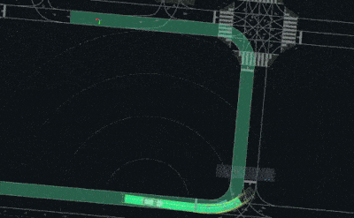
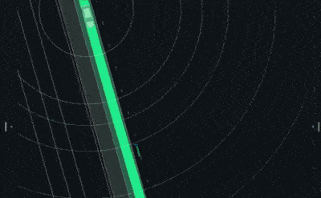

# Autoware Diffusion Planner

## Overview

The **Autoware Diffusion Planner** is a trajectory generation module for autonomous vehicles, designed to work within the [Autoware](https://www.autoware.org/) ecosystem. It leverages the [Diffusion Planner](https://github.com/ZhengYinan-AIR/Diffusion-Planner) model, as described in the paper ["Diffusion-Based Planning for Autonomous Driving with Flexible Guidance"](https://arxiv.org/abs/2309.00615) by Zheng et al.

This planner generates smooth, feasible, and safe trajectories by considering:

- Dynamic and static obstacles
- Vehicle kinematics
- User-defined constraints
- Lanelet2 map context
- Traffic signals and speed limits

It is implemented as a ROS 2 component node, making it easy to integrate into Autoware-based stacks. The node is aimed at working within the proposed [Autoware new planning framework](https://github.com/tier4/new_planning_framework).

---

## Features

- **Diffusion-based trajectory generation** for flexible and robust planning

  [](media/diffusion_planner.gif)

- **Integration with Lanelet2 maps** for lane-level context

  [](media/lanelet_map_integration.png)

- **Dynamic and static obstacle handling** using perception inputs

  [](media/diffusion_planner_reacts_to_bus.gif)

  [](media/reaction_to_other_agents.gif)

- **Traffic signal and speed limit awareness**

  [](media/traffic_light_support.gif)

- **ONNX Runtime** inference for fast neural network execution
- **ROS 2 publishers** for planned trajectories, predicted objects, and debug markers

---

## Installation

### Dependencies

- [ONNX Runtime](https://onnxruntime.ai/) (see `CMakeLists.txt` for version and path)
- Autoware Universe packages
- Eigen3
- Lanelet2
- C++17

### Build

Clone this package into your Autoware workspace and build with colcon:

```bash
cd ~/autoware/src
git clone <this-repo-url>
cd ~/autoware
rosdep install --from-paths src --ignore-src -r -y
colcon build --packages-select autoware_diffusion_planner
```

---

## Usage

Launch the planner as a component node:

```bash
ros2 launch autoware_diffusion_planner diffusion_planner.launch.xml
```

Or include it in your Autoware launch setup.

---

## Parameters

Parameters can be set via YAML (see `config/diffusion_planner.param.yaml`) or via the ROS 2 parameter server.

### Main Parameters

| Name                                   | Type    | Default         | Description                                                      |
|---------------------------------------- |---------|-----------------|------------------------------------------------------------------|
| `onnx_model_path`                      | string  | ""              | Path to the ONNX model file for the diffusion planner            |
| `args_path`                            | string  | ""              | Path to model argument/configuration file                        |
| `planning_frequency_hz`                | double  | 10.0            | Planning frequency in Hz                                         |
| `predict_neighbor_trajectory`           | bool    | false           | Predict trajectories for neighbor agents                         |
| `update_traffic_light_group_info`       | bool    | false           | Enable updating of traffic light group info                      |
| `traffic_light_group_msg_timeout_seconds`| double | 0.2             | Timeout for traffic light group messages (seconds)               |

### Debug Parameters

| Name                        | Type  | Default | Description                       |
|-----------------------------|-------|---------|-----------------------------------|
| `debug_params.publish_debug_map`   | bool  | false   | Publish debug map markers         |
| `debug_params.publish_debug_route` | bool  | false   | Publish debug route markers       |

---

## Inputs

- `/input/odometry` (nav_msgs/msg/Odometry): Ego vehicle odometry
- `/input/acceleration` (geometry_msgs/msg/AccelWithCovarianceStamped): Ego acceleration
- `/input/tracked_objects` (autoware_perception_msgs/msg/TrackedObjects): Detected dynamic objects
- `/input/traffic_signals` (autoware_perception_msgs/msg/TrafficLightGroupArray): Traffic light states
- `/input/vector_map` (autoware_map_msgs/msg/LaneletMapBin): Lanelet2 map
- `/input/route` (autoware_planning_msgs/msg/LaneletRoute): Route information

## Outputs

- `/output/trajectory` (autoware_planning_msgs/msg/Trajectory): Planned trajectory for the ego vehicle
- `/output/trajectories` (autoware_new_planning_msgs/msg/Trajectories): Multiple candidate trajectories
- `/output/predicted_objects` (autoware_perception_msgs/msg/PredictedObjects): Predicted future states of dynamic objects
- `/debug/lane_marker` (visualization_msgs/msg/MarkerArray): Lane debug markers
- `/debug/route_marker` (visualization_msgs/msg/MarkerArray): Route debug markers

---

## Example Configuration

```yaml
onnx_model_path: "/path/to/diffusion_planner.onnx"
args_path: "/path/to/model_args.yaml"
planning_frequency_hz: 10.0
predict_neighbor_trajectory: false
update_traffic_light_group_info: true
traffic_light_group_msg_timeout_seconds: 0.2

debug_params:
  publish_debug_map: true
  publish_debug_route: false
```

---

## Testing

Unit tests are provided and can be run with:

```bash
colcon test --packages-select autoware_diffusion_planner
colcon test-result --all
```

---

## Development & Contribution

- Follow the [Autoware coding guidelines](https://autowarefoundation.github.io/autoware-documentation/main/contributing/).
- Contributions, bug reports, and feature requests are welcome via GitHub issues and pull requests.

---

## References

- [Diffusion Planner (original repo)](https://github.com/ZhengYinan-AIR/Diffusion-Planner)
- ["Diffusion-Based Planning for Autonomous Driving with Flexible Guidance"](https://arxiv.org/abs/2309.00615)
- [Autoware Universe](https://github.com/autowarefoundation/autoware.universe)

---

## License

This package is released under the Apache 2.0 License.
